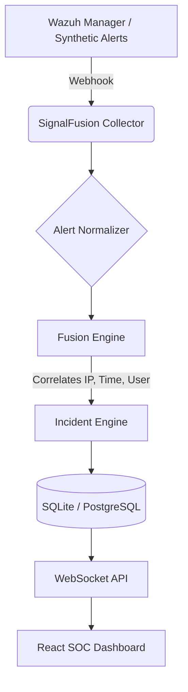

<div align="center">
  <h1>🛡️ SignalFusion</h1>
  <p><strong>Intelligent Alert Fusion for Modern Security Operations Centers (SOCs)</strong></p>
  <p><i>Built for the Smart India Hackathon (SIH)</i></p>
</div>

---

## 🛑 The Problem
Security Operations Centers (SOCs) are drowning in alerts. A single attacker attempting to compromise a server can generate hundreds of separate, noisy alerts across firewalls, endpoint agents, and cloud authenticators. Security analysts waste valuable time manually piecing together these disjointed alerts to understand the attack.

## 💡 The Solution
**SignalFusion** automatically correlates and fuses related security alerts into meaningful, high-fidelity security incidents. By reducing alert overload, SignalFusion helps analysts investigate faster and focus on the actual attack story, rather than individual events.

### 🌟 Key Features
- **Explainable Fusion Engine:** Automatically groups alerts based on shared entities (IP, User, Target, Time Proximity) and provides clear reasoning for *why* they were fused.
- **Real-Time Wazuh Integration:** Natively ingests live telemetry from Wazuh via Webhooks.
- **MITRE ATT&CK Mapping:** Automatically maps raw alert events to actionable MITRE tactics and techniques.
- **Live SOC Dashboard:** A React-powered dashboard utilizing WebSockets for zero-refresh, real-time incident tracking.
- **Incident Prioritization:** Evaluates attack progression to automatically escalate incidents to `CRITICAL` or `HIGH` severity.

---

## 🏗️ Architecture



---

## 🚀 Getting Started

You can run SignalFusion locally or instantly in the cloud via GitHub Codespaces!

### Option A: Run in GitHub Codespaces
Click the **Code** button on this repository and select **Create codespace**. A cloud environment will spin up with everything pre-installed!

### Option B: Run with Docker Compose (Recommended)

**Prerequisites:** Docker and Docker Compose

Start the entire stack (PostgreSQL, Backend, Frontend) with a single command:
```bash
docker compose up -d --build
```
*The API will start on `http://localhost:8000` and the Dashboard will start on `http://localhost:5173`*

### Option C: Run Locally (Without Docker)

**Prerequisites:** Python 3.10+ and Node.js (v20+)

#### 1. Start the Backend (Terminal 1)
```bash
python -m venv venv
source venv/Scripts/activate  # On Windows: .\venv\Scripts\activate
pip install -r backend/requirements.txt
PYTHONPATH=. uvicorn backend.main:app --reload
```
*The API will start on `http://localhost:8000`*

#### 2. Start the Frontend (Terminal 2)
```bash
cd frontend
npm install
npm run dev
```
*The Dashboard will start on `http://localhost:5173`*

---

## 🎮 How to Test & Demo
1. Open your browser to `http://localhost:5173/`.
2. Click **"Simulate APT Attack"** to inject a stream of synthetic security alerts.
3. Watch the Fusion Engine correlate those raw alerts into a single, high-severity Incident in real-time.
4. Click on the generated incident to see the attack timeline, MITRE mappings, and the explainable correlation reasoning.

**Testing Live Wazuh Integration:**
If you have a live Wazuh environment, you can configure it to push alerts directly to SignalFusion. Follow the instructions in [docs/wazuh-setup.md](./docs/wazuh-setup.md).
Alternatively, you can simulate a live Wazuh instance pushing webhooks by running:
```bash
PYTHONPATH=. python collectors/wazuh/wazuh_simulator.py
```

---

## 🛠️ Technology Stack
- **Backend:** Python, FastAPI, SQLAlchemy
- **Database:** PostgreSQL (with Docker) or SQLite (Local fallback)
- **Frontend:** React, Vite, TailwindCSS, WebSockets
- **Security:** Native Wazuh Integration

